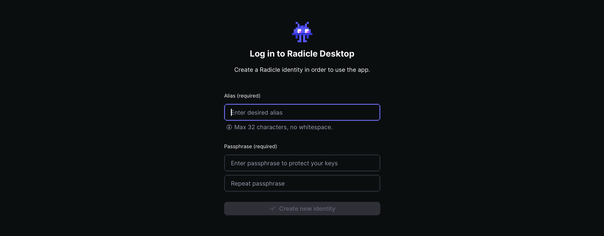
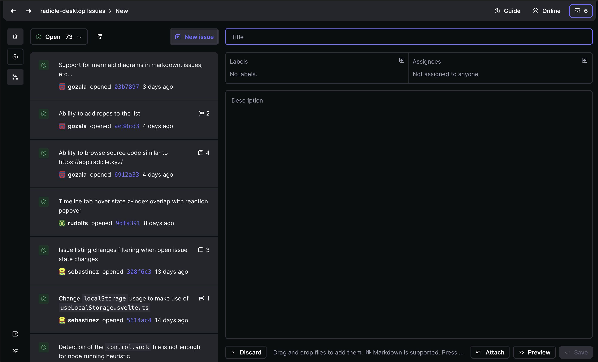
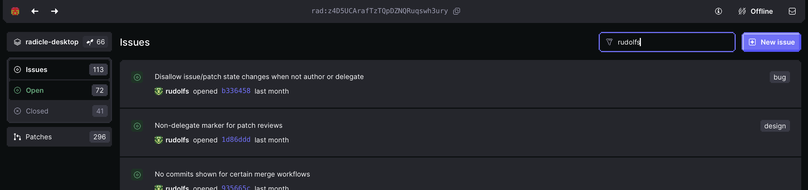
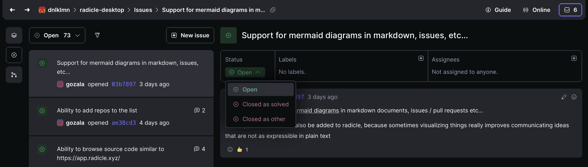
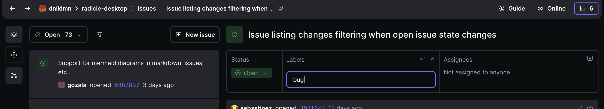

## Getting Started

### Overview

The Radicle desktop app is a graphical interface for interacting with the Radicle network. Follow these steps to get started:
<br/>
1. **Download the app**  
   Get the desktop app for your operating system.
   [Download Desktop App](#installation)
   <br/>

2. **Create or import an identity**  
   Your Radicle identity is your passport to the network.
   <br/>

3. **Install and start your node**  
   The Radicle node runs on your computer and keeps you in sync with the network.
   [Install instructions](#cli-first-steps)

<br/>

4. **Try it out!**  
   You are now on Radicle! Initialize your first repo or clone something you like!

### Installation

Get started quickly

<!-- Download component will be inserted here -->

### Build from Source

Run the following commands to build the desktop app locally:

```bash
git clone https://seed.radicle.xyz/z4D5UCArafTzTQpDZNQRuqswh3ury.git radicle-desktop
cd radicle-desktop
npm install
npm run tauri build
```

Then run one of the builds that the script outputs at the end.

### Prerequisites

Make sure you have the following

- Recent versions of Node.js (22.11.0 or higher) and npm installed
- Requires the Rust toolchain (1.77 or higher)
- [Tauri system dependencies](https://v1.tauri.app/v1/guides/getting-started/prerequisites/)

## Desktop App

### First steps

Once the app is launched, it will pick up on your Radicle identity and automatically connect to your node, or offer to create a new identity if you don't have one.



You'll be prompted to add an alias and a passphrase, both of which you will be able to change later.

Once you click create new identity, your identity will be created and stored on your computer in an SSH agent.

### App Header

#### Breadcrumbs 

Breadcrumbs indicate where you are and provide a way to copy IDs of current pages and to view them on a seed node.

<br/>

#### Guide

You'll always find the guide popover in the header. It will help you get set up and provide useful hints as you go.

<br/>

#### Node status indicator

Always see if your node is online or offline. 

<br/>

#### Inbox indicator

Opens inbox popover with the latest changes organized by repo. 

### Issues

Track and manage issues directly within the app. The issues are stored safely on your computer in your Radicle storage.

<br/>

#### Working with Issues

To create an issue, click on the "New issue" button in the top right corner of the issues page. You can then fill out the form to create a new issue.



**Fuzzy Filter**

Use the fuzzy filter to find an issue by name, description, label, or author.



**Issue Status**
Issues can be in one of the following states: open, closed as solved, and closed as other. Use the dropdown in the metadata table at the top of the page to change issue status.




**Issue Labels**
Issues can be labeled with any number of labels. Add labels from the metadata table at the top of the page.



**Issue Assignees**
Issues can be assigned to any number of users. Add assignees by entering their DIDs into the assignees field.

### Patches

// To do

### Code Reviews

Collaborate on code changes with integrated review tools:

- Create and review patches
- Comment on specific lines of code
- Suggest changes
- Approve and merge contributions


## Radicle Basics

### Radicle Identity

Your Radicle identity is your passport to the network. It is a public key that is used to identify you on the network. You can create a new identity or import an existing one.

### Radicle Node

Your Radicle node is the application that runs on your computer and keeps you in sync with the network. It is a peer-to-peer application that allows you to interact with the Radicle network.

## Frequently Asked Questions


### How is Radicle different from GitHub or GitLab?

Radicle is fundamentally different because it's built on a peer-to-peer architecture. There is no central server or company controlling your data. Your repositories exist on your device and are shared directly with collaborators.

### Do I need an internet connection to use Radicle?

No, you can work completely offline. When you connect to the internet, you can sync with your peers to share updates.

### Is Radicle Desktop open source?

Yes, Radicle Desktop is entirely open source. You can find the source code on the Radicle network itself or on GitHub.

### How do I find other users and repositories?

Radicle provides discovery mechanisms through seeds (public nodes) and through direct sharing of repository IDs and node addresses.
